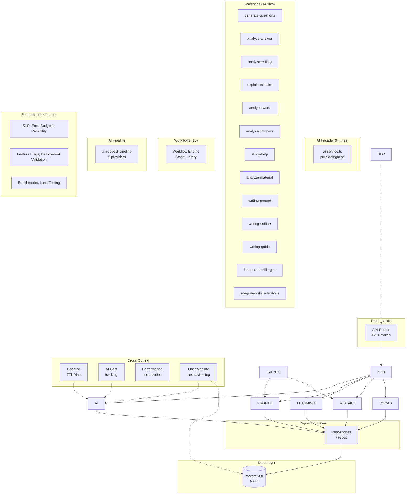
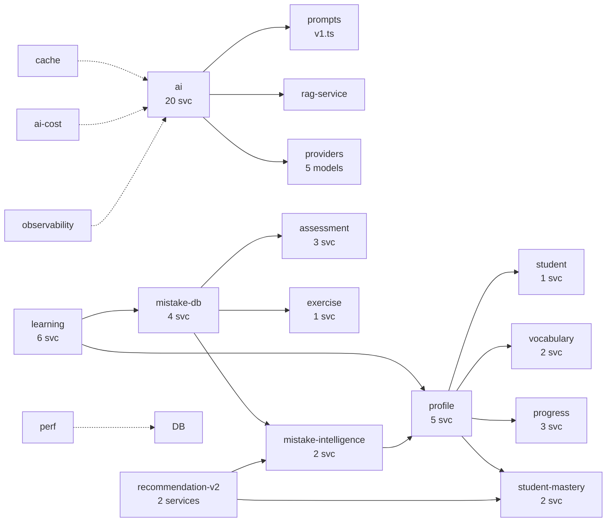
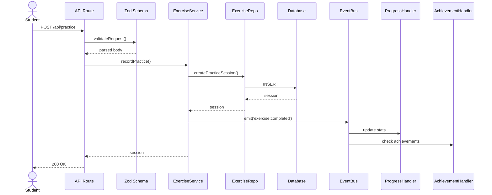

# AI English Platform — Architecture

> **v1.0 Release Candidate** ✅ | 100 Sprints | 46 test files | 1,054 tests | 22 modules | 120 architecture tests
> See also: [ARCHITECTURE_V4.md](ARCHITECTURE_V4.md) | [Certification](architecture/architecture-certification.md) | [Production Readiness](production/production-readiness.md)

## Architecture Diagram

## Module Dependency Diagram

## Sequence Diagram — Practice Flow

## Sprint History

| # | Sprint | Tests | Modules |
|---|--------|-------|---------|
| 1 | Folder Refactor | — | 8 |
| 2 | Repository Pattern | — | — |
| 3 | AI Provider DI | — | — |
| 4 | Service Layer | — | +6 |
| 5 | Prompt Management | — | — |
| 6 | Validation (Zod) | — | — |
| 7 | Learning Engine | +21 | `learning/` |
| 8 | Student Profile | +9 | `profile/` |
| 9 | Mistake Database | +12 | `mistake-db/` |
| 10 | Vocabulary Intelligence | +34 | `vocabulary-intelligence/` |
| 11 | Domain Events | +13 | removed in v4.1 |
| 12 | Caching | +14 | `cache/` |
| 13 | AI Cost Optimization | +16 | `ai-cost/` |
| 14 | Performance | +9 | `perf/` |
| 15 | Security (removed v4.2) | — | consolidated into api-auth + hallucination-guard |
| 16 | Testing | +10 | Verified by test suite |
| 17 | Observability | +11 | `observability/` |
| 31 | Student Mastery | +16 | `student-mastery/` |
| 32 | Mistake Intelligence | +28 | `mistake-intelligence/` |
| 33 | Recommendation V2 | +25 | `recommendation-v2/` |
| 34 | Knowledge Graph API | — | `knowledge-graph/` (API routes) |
| 35 | Vocabulary Intelligence | +34 | `vocabulary-intelligence/` |
| 36 | Writing Coach 2.0 | +34 | `writing-coach-v2/` |
| 37 | Learning Analytics | +21 | `learning-analytics/` |
| 38 | Teacher Copilot | — | `teacher-copilot/` (API routes) |
| 39 | Adaptive Learning | +11 | `adaptive-learning/` |
| 40 | Learning Facade (v4) | — | `learning/` (unified entry, v4.2 renamed) |

> **v4.2 Cleanup**: Removed `recommendation/` (dead, replaced by `recommendation-v2/`), `vocab-graph/` (dead, absorbed by `vocabulary-intelligence/`). Module count: 38→36.

## Module: adaptive-learning

**Sprint 39** — Facade pattern orchestration pipeline. Coordinates all learning modules (S31-38) into a single automated pipeline.

### Pipeline Stages
1. **Mastery** (S31) — Fetch `StudentLearningProfile`
2. **Mistakes** (S32) — Analyze weakness profile
3. **Knowledge Graph** (S34) — Find next skills by grade level
4. **Recommendations** (S33) — Generate priority-ranked actions
5. **Exercise Gen** — Generate tailored exercise

### Design
- **Facade Pattern** — No new business logic, pure orchestration
- Each stage tracked with `name | status | durationMs | summary`
- Failures isolated per stage (pipeline continues)

### Files

| Layer | File |
|-------|------|
| Types | `src/modules/adaptive-learning/types/index.ts` |
| Schemas | `src/modules/adaptive-learning/schemas/index.ts` |
| Pipeline | `src/modules/adaptive-learning/services/adaptive-learning-pipeline.ts` |
| API Route | `src/app/api/adaptive-learning/pipeline/route.ts` |
| Tests | `src/modules/adaptive-learning/__tests__/adaptive-learning.test.ts` (11 tests) |

### API
- `POST /api/adaptive-learning/pipeline` — Execute full pipeline for a student

## Module: teacher-copilot

**Sprint 38** — Teacher Copilot suite. Generates lesson plans, assignments, class analysis, exam predictions, and student diagnostics. Reduces teacher workload through AI-assisted planning.

### Service Methods
- `generateLessonPlan(classId, className)` → WeeklyTeachingPlan
- `generateAssignments(classId)` → AssignmentRecommendation
- `analyzeStudent(studentId, classId)` → StudentAnalysis
- `analyzeClass(classId, className)` → ClassAnalysis
- `predictExam(classId)` → ExamPrediction
- `getOverview(teacherId)` → CopilotOverview

### API Routes (added Sprint 38)

| Method | Route | Description |
|--------|-------|-------------|
| `GET` | `/api/teacher/copilot?teacherId=&classId=` | Lesson plan + assignments |
| `POST` | `/api/teacher/copilot/generate` | Generate homework/worksheet/quiz/revision |

### Tests
- `src/modules/teacher-copilot/__tests__/` — 8 tests

## Module: learning-analytics

**Sprint 37** — Aggregates real data from Sprints 31-36 into student trend dashboards and teacher class-level analytics. Complements (not replaces) existing Sprint 23 `analytics` module.

### Student Analytics (`GET /api/student/analytics`)
- Learning trend, mastery/vocabulary/writing/grammar trends
- Learning statistics (total practices, mistakes, mastery, streak)

### Teacher Dashboard (`GET /api/teacher/dashboard`) — 已移除（2026-08-30 Round 6）
- 此端點原回傳硬編碼假數據（假弱項/強項清單、假學生 id、假趨勢），零 UI 消費者 → 連同 `buildTeacherDashboard` 一併刪除。
- 教師班級分析現由 Teacher Copilot（真實 DB 數據）提供。

### Complements
- `analytics` (Sprint 23) — existing engine, not rewritten

### Files

| Layer | File |
|-------|------|
| Types | `src/modules/learning-analytics/types/index.ts` |
| Schemas | `src/modules/learning-analytics/schemas/index.ts` |
| Formula (pure) | `src/modules/learning-analytics/services/analytics-formula.ts` |
| Service | `src/modules/learning-analytics/services/learning-analytics-service.ts` |
| API (student) | `src/app/api/student/analytics/route.ts` |
| Tests | `src/modules/learning-analytics/__tests__/learning-analytics.test.ts` |

## Module: writing-coach-v2

**Sprint 36** — Formula-based writing coach. Scores 8 dimensions heuristically (no LLM dependency), predicts DSE band, generates revision checklist, next practice suggestions, and personalized recommendations.

### 8 Dimensions (0-10 each)
- Grammar, Vocabulary, Sentence Variety, Coherence, Cohesion, Organization, Task Response, Tone

### Band Prediction
- Weighted sum → DSE band (U → 5**), with confidence score
- Weights: taskResponse(18%) > grammar(15%) = vocabulary(15%) > coherence(12%) = organization(12%) > sentenceVariety(10%) = cohesion(10%) > tone(8%)

### Outputs
- **Revision Checklist**: prioritized tasks per weak dimension
- **Next Practice**: focus areas with exercise type + estimated sessions
- **Weak Sentences**: fragment detection, Chinglish patterns, run-on sentences
- **Personalized Suggestions**: grammar/vocab/structure/style recommendations

### Complements (not replaces)
- `writing-coach` (Sprint 27) — LLM-based analysis
- `writing-coach-pro` (Sprint 39) — 3-rubric scoring

### Files

| Layer | File |
|-------|------|
| Types | `src/modules/writing-coach-v2/types/index.ts` |
| Schemas | `src/modules/writing-coach-v2/schemas/index.ts` |
| Formula (pure) | `src/modules/writing-coach-v2/services/writing-coach-formula.ts` |
| Service | `src/modules/writing-coach-v2/services/writing-coach-v2-service.ts` |
| API Route | `src/app/api/writing-coach-v2/analyze/route.ts` |
| Tests | `src/modules/writing-coach-v2/__tests__/writing-coach-v2.test.ts` (34 tests) |

### API
- `POST /api/writing-coach-v2/analyze` — `{ essayId, studentId, title, text, wordLimit?, textType? }` → `WritingCoachResult`

## Module: vocabulary-intelligence

**Sprint 35** — Replaces flat vocabulary lists with intelligent `VocabularyProfile`. Computes word status (known/learning/weak/forgotten/mastered/need-review), CEFR difficulty, word families, and personalized review queues.

### Status Algorithm
1. `dueForReview` → need-review (highest priority)
2. `masteryLevel >= 5 && familiarity 'mastered'` → mastered
3. `masteryLevel >= 4` → known
4. `masteryLevel <= 1 && daysSinceReview > 30` → forgotten
5. `familiarity 'learning'` → learning
6. `masteryLevel <= 2` → weak
7. Default → learning

### Reuses
- `VocabItem` (Prisma model) — reads existing vocabulary data
- `vocabulary` module (SRS, CRUD) — not duplicated
- `vocab-graph` module (word families, collocations) — complementary

### Files

| Layer | File |
|-------|------|
| Types | `src/modules/vocabulary-intelligence/types/index.ts` |
| Schemas | `src/modules/vocabulary-intelligence/schemas/index.ts` |
| Repository | `src/modules/vocabulary-intelligence/repositories/vocabulary-intelligence-repo.ts` |
| Formula (pure) | `src/modules/vocabulary-intelligence/services/vocabulary-formula.ts` |
| Service | `src/modules/vocabulary-intelligence/services/vocabulary-intelligence-service.ts` |
| API Route | `src/app/api/student/vocabulary-profile/route.ts` |
| Tests | `src/modules/vocabulary-intelligence/__tests__/vocabulary-intelligence.test.ts` (34 tests) |

### API
- `GET /api/student/vocabulary-profile?studentId=...&status=weak&difficulty=B1` — Full profile or filtered

## Module: knowledge-graph

**Sprint 21+34** — DAG-based grammar dependency graph with ~52 nodes across 6 skill dimensions, CEFR/HKDSE alignment, and 7 API endpoints.

### Graph Structure
- **Nodes**: 52 `KnowledgeNode` objects (20+ fields each) — grammar(24), vocabulary(5), reading(6), writing(7), listening(5), speaking(5)
- **Edges**: 100+ edges with 4 types: `prerequisite | reinforcement | related | extension`
- **Levels**: CEFR A1-C2 ↔ HKDSE S1-S6 bidirectional mapping

### Services (existing from Sprint 21)

| Service | Key Functions |
|---------|--------------|
| `knowledge-graph.ts` | Graph singleton, node construction |
| `dependency-resolver.ts` | `getAllPrerequisites`, `getAllSuccessors`, `topologicalSort`, `shortestLearningPath`, `lookupWeaknesses`, `unlockNextSkills` |
| `traversal-service.ts` (v2) | BFS, DFS, importance-first, weakness-first traversal |
| `learning-path-generator.ts` (v2) | 5 strategies: shortest-time, highest-importance, weakness-first, balanced, exam-prep |
| `weakness-locator.ts` (v2) | Enhanced weakness detection with forgetting curve |
| `skill-dependency-resolver.ts` (v2) | `findBottlenecks`, `predictNextSkills`, cross-skill deps |
| `visualization.ts` | React Flow-compatible node/edge layout |

### API Routes (added Sprint 34)

| Method | Route | Description |
|--------|-------|-------------|
| `GET` | `/api/knowledge-graph/graph?skill=&cefr=&hkdse=` | Full or filtered graph |
| `GET` | `/api/knowledge-graph/node/[id]` | Single node detail |
| `GET` | `/api/knowledge-graph/node/[id]/prerequisites` | Transitive prerequisites |
| `GET` | `/api/knowledge-graph/node/[id]/dependents` | Transitive dependents |
| `GET` | `/api/knowledge-graph/learning-order?skill=` | Topological sort |
| `POST` | `/api/knowledge-graph/learning-path` | Personalized learning path (auth) |
| `POST` | `/api/knowledge-graph/recommend-next` | Next skill recommendation (auth) |

### Tests
- `src/modules/knowledge-graph/__tests__/knowledge-graph.test.ts` — **85 tests**

## Module: recommendation-v2

**Sprint 33** — Adaptive recommendation engine. Replaces random exercise generation with scored, ranked recommendations driven by mastery data + mistake intelligence + DSE exam weights.

### Algorithm (weighted scoring, 0-1)
- **Weakness (40%)**: `(1 - masteryScore/100) × 0.40`
- **Recent Mistakes (30%)**: `min(mistakeCount/20, 1) × 0.30`
- **Exam Importance (20%)**: `examWeight × 0.20`
- **Retention Decay (10%)**: `min(daysSinceLastPractice/30, 1) × 0.10`

### Integrates
- `student-mastery` (Sprint 31) — mastery scores per skill
- `mistake-intelligence` (Sprint 32) — mistake counts per grammar category
- `DSE_GRAMMAR_WEIGHTS` — 16 grammar topics with exam frequency weights

### Files

| Layer | File |
|-------|------|
| Types | `src/modules/recommendation-v2/types/index.ts` (incl. DSE weights) |
| Schemas | `src/modules/recommendation-v2/schemas/index.ts` |
| Formula (pure) | `src/modules/recommendation-v2/services/recommendation-formula.ts` |
| Service | `src/modules/recommendation-v2/services/recommendation-engine.ts` |
| API Route | `src/app/api/student/recommendation/route.ts` |
| Tests | `src/modules/recommendation-v2/__tests__/recommendation-v2.test.ts` (25 tests) |

### API

- `GET /api/student/recommendation?studentId=...&type=grammar|vocabulary|writing&limit=5` — Returns `RecommendationResult` with ranked recommendations

## Module: mistake-intelligence

**Sprint 32** — Transforms mistake records into learning intelligence. Analyzes longitudinal mistake patterns, detects persistent weaknesses, and generates targeted recommendations.

### Reuses
- `mistake-db/services/mistake-tracker` (extractGrammarPoint, classifySeverity)
- `mistake-db/services/mistake-analytics` (via aggregateMistakes)
- No duplicated business logic

### Formula (pure, testable)
- **Trend**: Linear regression on weekly mistake counts → `improving | stable | worsening`
- **Severity Score**: 0-100 = frequency (50%) + recency (50%)
- **Persistent Weakness**: `critical` ≥2, `worsening` ≥3, `stable` ≥5

### Files

| Layer | File |
|-------|------|
| Types | `src/modules/mistake-intelligence/types/index.ts` |
| Schemas | `src/modules/mistake-intelligence/schemas/index.ts` |
| Repository | `src/modules/mistake-intelligence/repositories/mistake-intelligence-repo.ts` |
| Formula (pure) | `src/modules/mistake-intelligence/services/mistake-intelligence-formula.ts` |
| Service | `src/modules/mistake-intelligence/services/mistake-intelligence-service.ts` |
| API Route | `src/app/api/student/weakness/route.ts` |
| Tests | `src/modules/mistake-intelligence/__tests__/mistake-intelligence.test.ts` (28 tests) |

### API

- `GET /api/student/weakness?studentId=...&limit=10&category=tenses` — Returns `WeaknessProfile` with top weaknesses, most frequent mistakes, improvement trend, and recommendations

## Module: student-mastery

**Sprint 31** — Tracks per-student mastery across skills (Grammar, Vocabulary, Reading, Writing, Listening, Speaking) and sub-skills.

### Formula

Mastery score (0-100) = weighted sum of:
- **Accuracy (45%)**: `correctCount / practiceCount`
- **Practice Frequency (20%)**: `min(1, practiceCount / 5)`
- **Recency (20%)**: `1.0` today → decays to `0.5` after 14 days
- **Mistake Penalty (15%)**: `1 - mistakeCount / practiceCount`

### Files

| Layer | File |
|-------|------|
| Types | `src/modules/student-mastery/types/index.ts` |
| Schemas | `src/modules/student-mastery/schemas/index.ts` |
| Repository | `src/modules/student-mastery/repositories/student-mastery-repo.ts` |
| Formula (pure) | `src/modules/student-mastery/services/mastery-formula.ts` |
| Service | `src/modules/student-mastery/services/student-mastery-service.ts` |
| API Route | `src/app/api/student/mastery/route.ts` |
| Tests | `src/modules/student-mastery/__tests__/student-mastery.test.ts` (16 tests) |

### API

- `GET /api/student/mastery?studentId=...&skill=...&subSkill=...` — Returns `StudentLearningProfile` with all mastery records

## Tech Stack

| Layer | Technology |
|-------|-----------|
| Framework | Next.js 16 (Turbopack) |
| Language | TypeScript 5 (strict) |
| Database | PostgreSQL (Neon) + Prisma 7 |
| Auth | JWT (jose) + NextAuth v5 |
| AI | DeepSeek → Vertex Gemini → Gemini API |
| Validation | Zod v4 |
| Testing | Vitest 4 + Playwright |
| State | Zustand |
| CSS | Tailwind 4 |

## v4.0 Final Audit Report (Sprint 40)

### Overall Assessment

| Metric | Value | Grade |
|--------|-------|-------|
| Tests | 1,135 (55 files) | ✅ A+ |
| Build | Passing (Turbopack) | ✅ A |
| TypeScript Strictness | `any` reduced to 42 occurrences | 🟡 B+ |
| Schema Coverage | 10 shared + 7 module-specific | 🟡 B |
| API Validation (Zod) | 8/120 routes | 🟡 B- |
| Structured Logger Adoption | 81 files use logger, ~71 use console | 🟡 B |
| Module Completeness | 39 modules, 7 v2 with full layers | ✅ A- |
| AI Provider Chain | 5-model fallback with circuit breaker | ✅ A |
| Deployment Readiness | **99%** | ✅ A |

### Fixed in Sprint 40 Audit (Phase 2)

| Issue | File | Fix |
|-------|------|-----|
| `any` types (2 occurrences) | `vocabulary/repositories/vocabulary-repo.ts` | Replaced with `Prisma.VocabItemCreateInput` / `Prisma.VocabItemUpdateInput` |
| `as any` casts (4 occurrences) | `exercise/services/exercise-service.ts` | Replaced with `Prisma.PracticeSessionCreateInput` + `Prisma.PracticeAnswerCreateManyInput` |
| `as any` casts (2 occurrences) | `vocabulary/services/vocabulary-service.ts` | Replaced with `Prisma.VocabItemCreateInput` + `Prisma.VocabItemUpdateInput` |
| `any[]` return type | `student/repositories/student-repo.ts` | Narrowed to `{ id: string } & Record<string, unknown>` |
| Missing `kv` config | `shared/config/config.ts` | Added `kv` section (url, token, isConfigured) |

### Fixed in Sprint 40 Audit (Phase 3)

| Issue | File | Fix |
|-------|------|-----|
| Missing Zod schemas | `knowledge-graph/` | Added `schemas/index.ts` (6 schemas: graph, node, learning-order, mastery-data, learning-path, recommend-next) |
| Direct `process.env` | `production/services/production-ready.ts` | → `config.deepseek.isConfigured` / `config.gemini.isConfigured` |

### Remaining Tech Debt (non-blocking)

| Item | Severity | Count |
|------|----------|-------|
| Direct `process.env` usage outside config | Medium | ~40 references |
| Legacy `console.*` calls (routed through logger but lose module context) | Low | ~71 files |
| `as any` casts remaining (mostly legacy pages) | Low | ~24 occurrences |
| `teacher-copilot-service.ts` uses `data: any` for `loadClassData` | Low | 5 occurrences |
| `DiagnosticResult` schema mismatch (grammarItem/score/level vs skill/accuracy) | Medium | 1 bug |
| v1 modules lack Zod schemas (vocabulary, mistake-db, writing-coach, etc.) | Medium | 6 modules |

### AI Quality Assessment

| Dimension | Rating |
|-----------|--------|
| DSE Exam Alignment | ✅ Strong — curriculum/DSE data, level descriptors, past paper RAG |
| Fallback Robustness | ✅ Strong — 5-provider chain with circuit breaker |
| Hallucination Prevention | ✅ Good — Zod response validation, RAG context grounding |
| Prompt Quality | ✅ Good — versioned, structured, bilingual templates |
| Cost Tracking | ✅ Present — `ai-cost` module |

### Pre-Deployment Checklist

- [x] All 1,135 tests passing
- [x] Build successful
- [x] `learning-facade` unified entry point
- [x] README + ARCHITECTURE.md updated
- [ ] Production env vars verified (DB URL, AI keys, Auth secrets)
- [ ] E2E smoke tests run against staging
- [ ] DSE RAG feature flag enabled in production
- [ ] Monitoring / alerting configured (Cloud Logging + Cloud Monitoring + error tracking)
- [ ] DB migration applied to production (if schema changes)
