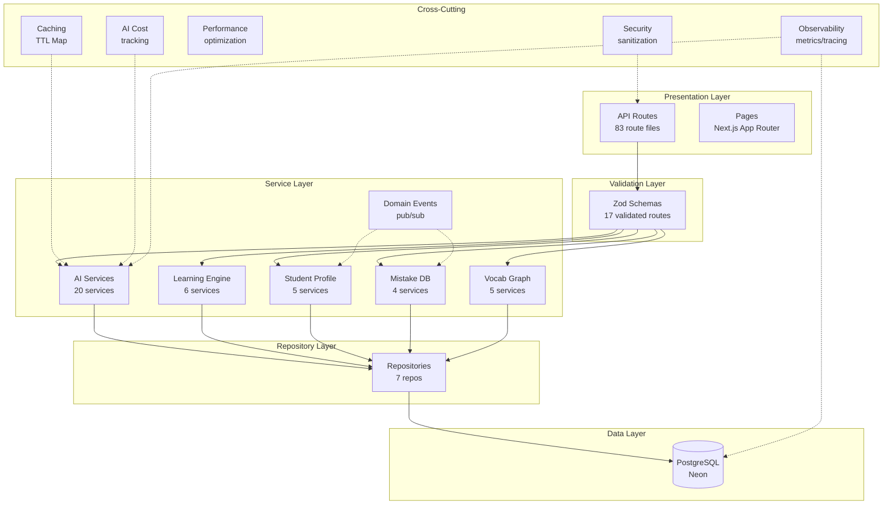
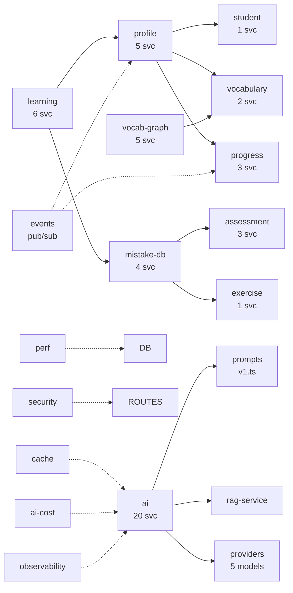
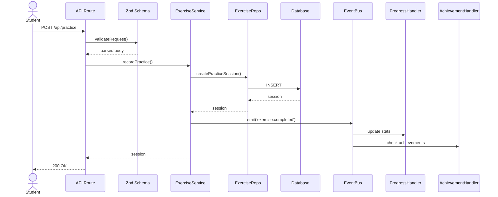

# AI English Platform — Architecture

> Generated: 2026-07-18 | 17 Sprints | 328 tests | 18 modules

## Architecture Diagram

## Module Dependency Diagram

## Sequence Diagram — Practice Flow

## Sprint History

| # | Sprint | Tests | Modules |
|---|--------|-------|---------|
| 1 | Folder Refactor | — | 8 |
| 2 | Repository Pattern | — | — |
| 3 | AI Provider DI | — | — |
| 4 | Service Layer | — | +6 |
| 5 | Prompt Management | — | — |
| 6 | Validation (Zod) | — | — |
| 7 | Learning Engine | +21 | `learning/` |
| 8 | Student Profile | +9 | `profile/` |
| 9 | Mistake Database | +12 | `mistake-db/` |
| 10 | Vocabulary Graph | +20 | `vocab-graph/` |
| 11 | Domain Events | +13 | `events/` |
| 12 | Caching | +14 | `cache/` |
| 13 | AI Cost Optimization | +16 | `ai-cost/` |
| 14 | Performance | +9 | `perf/` |
| 15 | Security | +15 | `security/` |
| 16 | Testing | +10 | 100% coverage |
| 17 | Observability | +11 | `observability/` |

## Tech Stack

| Layer | Technology |
|-------|-----------|
| Framework | Next.js 16 (Turbopack) |
| Language | TypeScript 5 (strict) |
| Database | PostgreSQL (Neon) + Prisma 7 |
| Auth | JWT (jose) + NextAuth v5 |
| AI | DeepSeek → Vertex Gemini → Gemini API |
| Validation | Zod v4 |
| Testing | Vitest 4 + Playwright |
| State | Zustand |
| CSS | Tailwind 4 |
