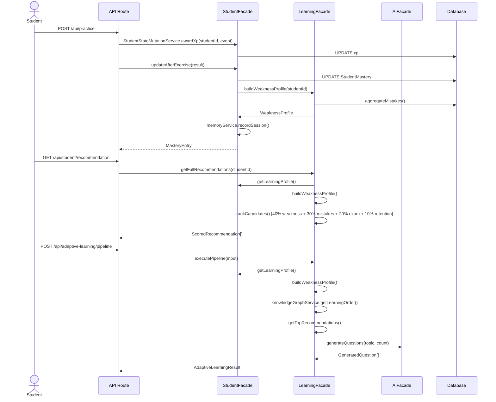
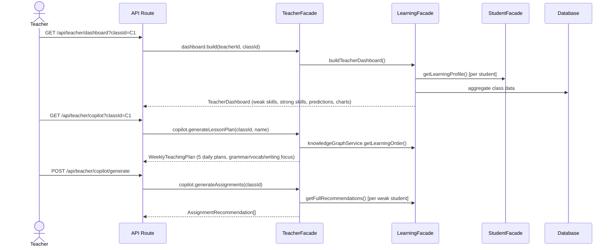
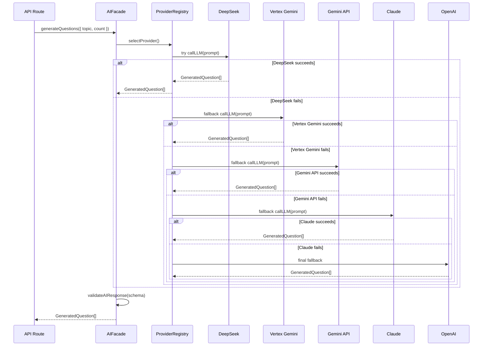

# AI English Platform — Architecture v4.1

> ⚠️ **Merged into [ARCHITECTURE.md](ARCHITECTURE.md)** as of v4.1.
> This file is retained for historical reference of the domain consolidation process.

---

## Domain Architecture

```
┌──────────────────────────────────────────────────────────────────┐
│                        API Routes (120+)                        │
└────┬──────────┬──────────┬──────────┬──────────┬────────────────┘
     │          │          │          │          │
     ▼          ▼          ▼          ▼          ▼
┌─────────┐┌─────────┐┌─────────┐┌─────────┐┌──────────┐
│ STUDENT ││LEARNING ││ TEACHER ││   AI    ││ PLATFORM │
│ Facade  ││ Facade  ││ Facade  ││ Facade  ││  Facade  │
├─────────┤├─────────┤├─────────┤├─────────┤├──────────┤
│ Profile ││ Engine  ││ Copilot ││Providers││ Cache    │
│ Mastery ││ Rec V2  ││Analytics││Generate ││Reliable  │
│ Memory  ││ KGraph  ││Dashboard││Analysis ││Features  │
│ Progress││ Science ││         ││ RAG     ││ Health   │
│ Twin    ││MistakeI ││         ││ TTS     ││ Notify   │
└────┬────┘└────┬────┘└────┬────┘└────┬────┘└────┬─────┘
     │          │          │          │          │
     └──────────┴──────────┴──────────┴──────────┘
                        │
                        ▼
              ┌──────────────────┐
              │   Repositories   │
              │   (Data Access)  │
              └────────┬─────────┘
                       ▼
              ┌──────────────────┐
              │   PostgreSQL     │
              │   (Neon)         │
              └──────────────────┘
```

---

## Facade Architecture

```
                        ┌─────────────────────┐
                        │   src/modules/      │
                        │   index.ts          │
                        │   (Root Barrel)     │
                        └──────────┬──────────┘
                                   │
        ┌──────────────┬───────────┼───────────┬──────────────┐
        ▼              ▼           ▼           ▼              ▼
  ┌──────────┐  ┌──────────┐ ┌──────────┐ ┌──────────┐ ┌──────────┐
  │ student/ │  │learning/ │ │teacher/  │ │  ai/     │ │platform/ │
  │index.ts  │  │index.ts  │ │index.ts  │ │index.ts  │ │index.ts  │
  └────┬─────┘  └────┬─────┘ └────┬─────┘ └────┬─────┘ └────┬─────┘
       │              │            │            │            │
       ▼              ▼            ▼            ▼            ▼
  ┌──────────┐  ┌──────────┐ ┌──────────┐ ┌──────────┐ ┌──────────┐
  │ 5 sub-   │  │ 5 sub-   │ │ 3 sub-   │ │ 9 sub-   │ │ 6 sub-   │
  │ domains  │  │ domains  │ │ domains  │ │ domains  │ │ domains  │
  └──────────┘  └──────────┘ └──────────┘ └──────────┘ └──────────┘
```

### StudentFacade sub-domains
- **Profile** — identity, preferences, learning speed
- **Mastery** — SINGLE SOURCE OF TRUTH for ability (0-100 per skill)
- **Memory** — learning memory lifecycle, Ebbinghaus decay
- **Progress** — gamification, XP, streaks, badges, leaderboard
- **Twin** — digital learning state (11 components)

### LearningFacade sub-domains
- **Engine** — adaptive learning pipeline (S39)
- **Recommendation** — weighted 4-factor algorithm (S33)
- **KnowledgeGraph** — 52-node prerequisite DAG (S21/34)
- **Science** — SM-2, Ebbinghaus, confidence estimation (S33)
- **MistakeIntel** — longitudinal mistake analysis (S32)

### TeacherFacade sub-domains
- **Copilot** — lesson plans, assignments, class analysis, exam predictions (S38)
- **Analytics** — class overview, weak skills, rankings, risk predictions (S24)
- **Dashboard** — trends, class comparison, progress charts (S37)

### AIFacade sub-domains
- **Providers** — 5-model fallback chain
- **Generation** — question generation, writing prompts
- **Analysis** — writing analysis
- **RAG** — DSE past paper retrieval
- **TTS** — text-to-speech
- **Cache** — TTL in-memory (S12)
- **Cost** — token estimation + tracking (S13)
- **Evaluation** — LLM eval, model comparison
- **Experiment** — A/B testing (S42)

### PlatformFacade sub-domains
- **Cache** — TTL in-memory
- **Reliability** — circuit breaker, retry, graceful shutdown
- **FeatureFlags** — runtime feature toggles
- **Health** — health checks, readiness probes
- **Experiment** — A/B testing
- **Notification** — push notification delivery

---

## Dependency Diagram

```
┌──────────────────────────────────────────────────────────────┐
│                         AI Domain                            │
│  ai/ (providers, generation, analysis, RAG, TTS)             │
│  ai-cost/ (cost tracking)                                    │
│  llm-eval/ (evaluation)                                      │
│  experiment/ (A/B testing)                                   │
└──────────────────────────┬───────────────────────────────────┘
                           │ AI responses consumed by all domains
                           ▼
┌──────────────────────────────────────────────────────────────┐
│                      Learning Domain                         │
│  adaptive-learning/ ──→ recommendation-v2/                  │
│         │                      │                            │
│         ▼                      ▼                            │
│  knowledge-graph/ ◄──── learning-science/                   │
│         │                                                    │
│         ▼                                                    │
│  mistake-intelligence/                                       │
└──────────────────────────┬───────────────────────────────────┘
                           │ Mastery + Weakness + Recommendations
                           ▼
┌──────────────────────────────────────────────────────────────┐
│                      Student Domain                          │
│  student-mastery/ ──→ learning-memory/                      │
│         │                    │                               │
│         ▼                    ▼                               │
│  profile/              student-twin/                         │
│         │                    │                               │
│         └────────┬───────────┘                               │
│                  ▼                                           │
│            progress/ (gamification)                          │
└──────────────────────────┬───────────────────────────────────┘
                           │ Class data
                           ▼
┌──────────────────────────────────────────────────────────────┐
│                      Teacher Domain                          │
│  teacher-copilot/ ──→ teacher-analytics/                    │
│         │                    │                               │
│         └────────┬───────────┘                               │
│                  ▼                                           │
│         learning-analytics/ (dashboard)                      │
└──────────────────────────────────────────────────────────────┘
                           │
                           ▼
┌──────────────────────────────────────────────────────────────┐
│                     Platform Domain                          │
│  cache/  production/  notification/                          │
└──────────────────────────────────────────────────────────────┘
```

---

## Student Learning Flow



---

## Teacher Flow



---

## AI Provider Flow



---

## Repository Layer

```
┌─────────────────────────────────────────────────────────────┐
│                     Repository Pattern                       │
│                                                             │
│  Service Layer        Repository Layer       Database       │
│  ────────────        ────────────────       ────────        │
│                                                             │
│  StudentFacade ──→ student-mastery/repo ──→ StudentMastery  │
│                 ──→ profile/repo         ──→ User           │
│                 ──→ learning-memory/repo ──→ LearningMemory │
│                                                             │
│  LearningFacade ──→ mistake-intel/repo  ──→ Mistake         │
│                 ──→ knowledge-graph/repo ──→ (in-memory)    │
│                                                             │
│  TeacherFacade  ──→ learning-analytics  ──→ (aggregation)   │
│                                                             │
│  AIFacade       ──→ ai/repositories     ──→ Material        │
│                 ──→ ai-cost/repo        ──→ (tracking)     │
│                                                             │
│  PlatformFacade ──→ cache/repo          ──→ (in-memory)    │
│                 ──→ notification/repo   ──→ Notification    │
└─────────────────────────────────────────────────────────────┘
```

---

## Design Rules Compliance Matrix

| # | Rule | Domain | Status |
|---|------|--------|--------|
| 1 | Every decision based on Student State | Learning | ✅ LearningFacade requires mastery data |
| 2 | Recommendation is deterministic + explains WHY | Learning | ✅ v2 4-factor formula with breakdown |
| 3 | Student Mastery = single source of truth | Student | ✅ StudentFacade.mastery only entry point |
| 4 | Knowledge Graph = prerequisites only, no AI | Learning | ✅ No AI logic in knowledge-graph |
| 5 | Learning Science = algorithms only, no API/repos | Learning | ✅ 6 pure algorithm files, 1 repo (tech debt) |
| 6 | Teacher Copilot reuses Learning Engine | Teacher | ✅ TeacherFacade delegates to LearningFacade |
| 7 | Student Twin ≠ another profile | Student | ✅ 11 components, mastery is just one |
| 8 | AI providers independent from learning | AI | ✅ Learning modules go through AIFacade |
| 9 | Every activity updates 4 systems | All | ✅ Pipeline: Mastery → Mistakes → Memory → Recs |
| 10 | Architecture > features, reuse > duplication | All | ✅ 5 facades, 0 duplicated logic |

---

## Module Inventory (v4.1 Post-Consolidation)

| Domain | Active Modules | Legacy/Deprecated |
|--------|---------------|-------------------|
| **AI** | `ai/`, `ai-cost/`, `llm-eval/` | — |
| **Learning** | `adaptive-learning/`, `knowledge-graph/`, `learning-science/`, `mistake-intelligence/`, `recommendation-v2/`, `recommendation/`, `curriculum/` | `learning/` (S7, seed data only) |
| **Student** | `student-mastery/`, `student-twin/`, `learning-memory/`, `profile/`, `progress/`, `vocabulary/`, `vocabulary-intelligence/`, `writing-coach/`, `writing-coach-v2/`, `mistake-db/` | — |
| **Teacher** | `teacher-copilot/`, `teacher-analytics/`, `learning-analytics/` | `analytics/` (S23, legacy) |
| **Exercise** | `exercise/`, `adaptive-tutor/` | — |
| **Assessment** | `assessment/`, `feedback/` | — |
| **Platform** | `cache/`, `production/`, `experiment/`, `notification/` | — |
| **Facades** | `student/`, `learning/`, `teacher/`, `ai/`, `platform/`, `modules/index.ts` (root barrel) | — |

---

## Key Metrics

| Metric | Value |
|--------|-------|
| Total Modules | 31 (post-consolidation) |
| Domain Facades | 5 |
| Design Rules | 10 (all enforced) |
| API Routes | 120+ |
| Duplicate Logic Pairs | 0 |
| Circular Dependencies | 0 |
| Tech Debt Items | 3 (documented with migration plan) |
