# 📊 Dependency Report — AI English Platform
## Sprint 0: Architecture Analysis
**Date:** 2026-07-18

---

## 1. Dependency Graph

```mermaid
graph TD
    subgraph "Leaf Modules (Zero Internal Dependencies)"
        types[types.ts]
        i18n[i18n.ts]
        utils[utils.ts]
        api-response[api-response.ts]
        auth-cookies[auth-cookies.ts]
        plagiarism[plagiarism.ts]
        srs[srs.ts]
        gamification[gamification.ts]
        ai-schema[ai-schema.ts]
        chinglish[chinglish.ts]
        import-utils[import-utils.ts]
        ai-dse-topics[ai/dse-topics.ts]
        ai-dse-writing[ai/dse-writing-data.ts]
        ai-mcq-filters[ai/mcq-filters.ts]
        ai-sanitizer[ai/sanitizer.ts]
        ai-is-config[ai/integrated-skills-config.ts]
        ai-prompts[ai/prompts/*.ts -- 10 files]
        ai-topic-selector[ai/topic-selector.ts]
    end

    subgraph "Infrastructure"
        logger[logger.ts]
        config[config.ts]
        vercel-kv[vercel-kv.ts]
        gcp-auth[gcp-auth.ts]
        db[db.ts]
        ai-cache[ai-cache.ts]
        vertex-embeddings[vertex-embeddings.ts]
        ai-topic-selector --> ai-dse-topics
        vercel-kv --> logger
        ai-cache --> logger
        ai-cache --> vercel-kv
        db --> config
        db --> logger
        vertex-embeddings --> gcp-auth
        vertex-embeddings --> config
    end

    subgraph "Auth Layer"
        jwt[jwt.ts]
        crypto[crypto.ts]
        auth[auth.ts]
        auth-next[auth-next.ts]
        api-auth[api-auth.ts]
        admin-auth[admin-auth.ts]
        crypto --> logger
        jwt --> types
        auth --> types
        auth --> jwt
        auth --> db
        auth --> crypto
        auth --> logger
        auth-next --> db
        auth-next --> logger
        api-auth --> jwt
        api-auth --> auth-next
        api-auth --> types
        api-auth --> db
        admin-auth --> api-auth
    end

    subgraph "AI & Feature Services"
        rag-service[rag-service.ts]
        ai-service[ai-service.ts]
        rate-limiter[rate-limiter.ts]
        tts-service[tts-service.ts]
        notifications[notifications.ts]
        streak-service[streak-service.ts]
        rag-service --> db
        rag-service --> config
        rag-service --> logger
        ai-service --> ai-schema
        ai-service --> gcp-auth
        ai-service --> rag-service
        ai-service --> config
        ai-service --> logger
        ai-service --> ai-cache
        ai-service --> ai-sanitizer
        ai-service --> chinglish
        ai-service --> ai-dse-topics
        ai-service --> ai-dse-writing
        ai-service --> ai-mcq-filters
        ai-service --> ai-is-config
        ai-service --> ai-topic-selector
        ai-service --> ai-prompts
        rate-limiter --> vercel-kv
        rate-limiter --> config
        tts-service --> gcp-auth
        notifications --> db
        notifications --> logger
        streak-service --> db
    end

    subgraph "Consumers (Routes, Pages, Components)"
        api-routes[API Routes ~90 files]
        pages[Pages ~50 files]
        components[Components ~22 files]
        stores[Zustand Stores]
        middleware[middleware.ts]
        api-routes --> ai-service
        api-routes --> api-auth
        api-routes --> db
        api-routes --> rate-limiter
        pages --> components
        pages --> stores
        components --> stores
        stores -.-> api-routes
        middleware --> auth-cookies
    end
```



---

## 2. Cyclic Dependency Analysis

### ✅ **RESULT: No cyclic dependencies found.**

All imports form a strict **Directed Acyclic Graph (DAG)** with clear layered architecture:

```
Leaf Modules → Infrastructure → Auth Layer → Feature Services → Consumers (Routes/Pages)
```

### Verification Paths Checked:

| Path | Result |
|---|---|
| `ai-service.ts → rag-service.ts → db.ts → config.ts` | ✅ Linear |
| `api-auth.ts → auth-next.ts → db.ts` | ✅ Linear |
| `ai-service.ts → ai-cache.ts → vercel-kv.ts → logger.ts` | ✅ Linear |
| `admin-auth.ts → api-auth.ts → ...` | ✅ Linear |
| `auth.ts → jwt.ts → types.ts` | ✅ Linear |
| `rate-limiter.ts → vercel-kv.ts → logger.ts` | ✅ Linear |
| `notifications.ts → db.ts → config.ts` | ✅ Linear |

---

## 3. Import Pattern Analysis

### 3.1 Prisma/db Import Distribution

| Consumer Category | File Count | Pattern |
|---|---|---|
| API Route Handlers | **56** | Direct `import db from '@/lib/db'` |
| Library Modules | **6** | `auth.ts`, `auth-next.ts`, `api-auth.ts`, `notifications.ts`, `rag-service.ts`, `streak-service.ts` |
| Page Components | **1** | `src/app/page.tsx` (root server component) |
| Stores | **0** | ✅ Clean — all data via `fetch()` |
| UI Components | **0** | ✅ Clean — all data via props |

### 3.2 Import Style Inconsistency

| Style | Usage Count | Issue |
|---|---|---|
| `import db from '@/lib/db'` | **26 files** | Default import of named export (relies on `esModuleInterop`) |
| `import { db } from '@/lib/db'` | **10 files** | Named import (correct ESM) |
| `import { getBulkDb } from '@/lib/db'` | **2 files** | Named import (correct) |
| Dynamic `import('@/lib/db')` | **1 file** | Edge-compatible dynamic import |

**⚠️ Risk:** `db.ts` has `export const db` (named export) with **no** `export default`. Five library files use default import syntax, which works only because `esModuleInterop: true` papers over the mismatch. Could break under strict ESM environments.

### 3.3 AI Service Dependencies

`ai-service.ts` imports from **15** other modules, making it the most-connected node in the graph:

```
ai-service.ts imports:
  ├── ai-schema.ts
  ├── gcp-auth.ts
  ├── rag-service.ts (→ db, config, logger)
  ├── config.ts
  ├── logger.ts
  ├── ai-cache.ts (→ logger, vercel-kv)
  ├── ai/sanitizer.ts
  ├── ai/dse-topics.ts
  ├── ai/dse-writing-data.ts
  ├── ai/mcq-filters.ts
  ├── ai/integrated-skills-config.ts
  ├── ai/topic-selector.ts (→ ai/dse-topics)
  ├── ai/prompts/gemini-json-instruction.ts
  ├── ai/prompts/answer-rules.ts
  ├── ai/prompts/question-generation.ts
  └── chinglish.ts
```

---

## 4. External Dependencies (Production)

### Critical/Heavy Dependencies

| Package | Risk | Notes |
|---|---|---|
| `@google-cloud/aiplatform` | 🟡 Medium | Vertex AI SDK — large bundle size, only used server-side |
| `@google-cloud/text-to-speech` | 🟡 Medium | TTS — large bundle, server-only |
| `@google-cloud/vision` | 🟡 Medium | OCR — server-only |
| `next-auth@5.0.0-beta` | 🔴 High | Beta software in production auth path |
| `@prisma/client` + `@prisma/adapter-pg` | 🟢 Low | Well-maintained, stable |
| `pdf-parse` + `pdfkit` + `jspdf` | 🟢 Low | Document processing — multiple PDF libs (consider consolidation) |
| `docx` + `mammoth` | 🟢 Low | Two Word document libraries — consider consolidating to one |

### Development Dependencies

| Package | Risk | Notes |
|---|---|---|
| `@vitejs/plugin-react` | 🟢 Low | Only needed if using Vitest browser mode |
| `playwright` | 🟢 Low | E2E testing |
| `vitest` | 🟢 Low | Unit testing |

---

## 5. `process.env` Access Patterns

### Files Bypassing `config.ts` (Centralized Config)

| File | Env Vars Accessed | Severity |
|---|---|---|
| `lib/ai-cache.ts` | `AI_CACHE_ENABLED`, `AI_CACHE_TTL_MS`, `VERCEL_KV_URL` | 🟡 MEDIUM |
| `lib/ai-service.ts` | `AI_TIMEOUT_MS` (×3), `NODE_ENV` | 🟡 MEDIUM |
| `lib/auth-next.ts` | `NODE_ENV`, `VERCEL` (×3) | 🟡 MEDIUM |
| `lib/jwt.ts` | `JWT_SECRET` | 🟡 MEDIUM |
| `lib/logger.ts` | `LOG_LEVEL`, `NODE_ENV`, `VERCEL` | 🟢 LOW (bootstrapping) |
| `lib/rag-service.ts` | `DSE_RAG_ENABLED` | 🔴 HIGH (missing from config.ts!) |
| `lib/vercel-kv.ts` | `VERCEL_KV_URL`, `VERCEL_KV_TOKEN`, `NODE_ENV` | 🟢 LOW (bootstrapping) |
| `lib/db.ts` | `DATABASE_URL` | 🟢 LOW (bootstrapping) |
| `lib/gcp-auth.ts` | `GCP_SERVICE_ACCOUNT_JSON`, `GOOGLE_APPLICATION_CREDENTIALS` | 🟢 LOW (auth init) |
| Various API routes | `NODE_ENV`, `VERCEL_ENV`, `CRON_SECRET`, `VERCEL_URL` | 🟡 MEDIUM |

**Total:** ~73 `process.env` accesses across 24 files.

### Missing from `config.ts`:
- `DSE_RAG_ENABLED`
- `AI_TIMEOUT_MS` (defined as `config.ai.timeoutMs` but `ai-service.ts` reads directly)
- `AI_CACHE_ENABLED` / `AI_CACHE_TTL_MS` (defined as `config.ai.cacheEnabled` / `config.ai.cacheTTLMs` but `ai-cache.ts` reads directly)
- `CRON_SECRET`
- `VERCEL_KV_URL` / `VERCEL_KV_TOKEN`

---

## 6. Direct `@prisma/client` Imports

Only **4 files** import from `@prisma/client`:
- `src/lib/db.ts` — **instance creation** (correct, only allowed location)
- `src/app/api/admin/export/students/route.ts` — **type-only** `import type { Prisma }`
- `src/app/api/admin/users/route.ts` — **type-only** `import type { Prisma }`
- `src/app/api/vocabulary/route.ts` — **type-only** `import type { Prisma }`

✅ **No violations found** — all three non-db.ts imports are `import type` only, which is acceptable.

---

## 7. Summary

| Finding | Status |
|---|---|
| Cyclic dependencies | ✅ **None found** |
| Circular imports | ✅ **None found** |
| Direct `@prisma/client` (non-type) outside db.ts | ✅ **None found** |
| Config bypass (process.env instead of config.ts) | ⚠️ **10+ files** |
| Missing config entries | ⚠️ **5 env vars** |
| DB default import of named export | ⚠️ **5 files** |
| Inconsistent cookie name references | ⚠️ **2 files** |
| AI service depends on 15 modules | 🔴 **Excessive coupling** |
